# PII Mask

브라우저 전용 개인정보(PII) 탐지·마스킹 도구입니다. **모든 처리는 클라이언트에서만** 이루어지며, **파일은 어떤 서버로도 전송되지 않습니다.**


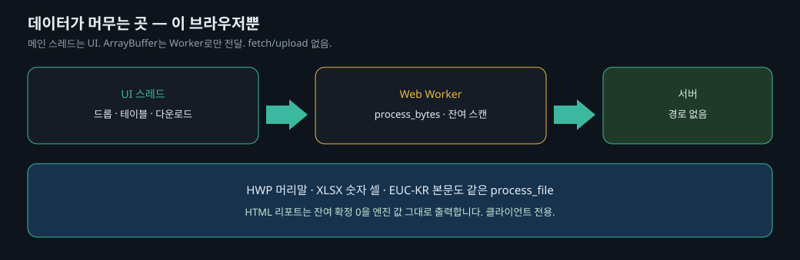

한글 공문·스프레드시트·스캔 아닌 PDF를 폴더 단위로 떨어뜨리면, Web Worker 안의 Rust/WASM이 주민등록번호부터 계좌·카드까지 검증식과 함께 찾고, 원 포맷을 유지한 마스킹본과 CSV/JSON/HTML 리포트를 돌려줍니다. HWP 머리말, 엑셀 숫자 셀(공유 문자열이 아닌 `<v>`), EUC-KR 텍스트도 **같은 `process_file`** 을 탑니다. HTML·CSV 리포트의 「잔여 확정」은 마스킹본을 엔진이 다시 센 값입니다. JSON 치환 모드(`[주민번호]`)도 객체를 깨지 않습니다. 엑셀 **숫자 셀**의 카드번호는 공유 문자열 인덱스와 구분해 마스킹합니다. EUC-KR 한글 텍스트는 같은 코드페이지로 다시 씁니다. docagent가 아직 파일 바이트로 왕복하지 않는 HWP 머리말 컨트롤은 코덱 한계이며, DOCX 머리말 XML은 지원합니다.

## 왜 브라우저인가

기관 PC에서  ind 문서를 외부 API로 올리는 순간 이미 유출입니다. PII Mask는 `fetch`/`upload` 경로가 없습니다. 파일 바이트는 메인 스레드에서 Worker로만 옮겨지고, 탐지·마스킹은 `pii-core`가 같은 프로세스 안에서 끝냅니다. 마스킹 뒤에는 **같은 엔진으로 잔여 확정 건수를 다시 셉니다.**

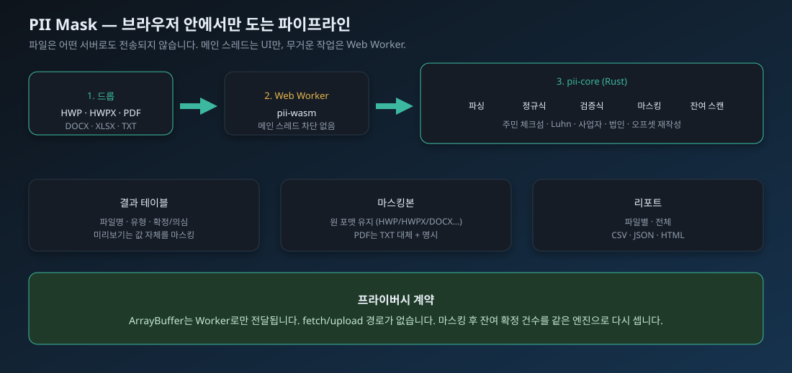

## 지원 포맷

우선순위는 한글 문서입니다. HWP/HWPX는 [docagent](https://github.com/kevin9327/docagent) 코덱으로 단락 오프셋을 유지한 채 추출하고 다시 씁니다. rhwp는 쓰지 않습니다.

| 확장자 | 엔진 | 마스킹 출력 |
|---|---|---|
| `.hwp` `.HWP` | docagent-hwp5 | 원 포맷 |
| `.hwpx` `.HWPX` | docagent-hwpx | 원 포맷 |
| `.hwp3` | docagent-hwp3 | 원 포맷 |
| `.txt` `.text` `.md` `.log` | 텍스트 | 원 포맷 |
| `.csv` `.json` | 구조 유지 재작성 (JSON 숫자는 문자열로 감싸 문법을 지킴) | 원 포맷 |
| `.pdf` | 텍스트 레이어 + **주석/양식 필드** (OCR 없음) | TXT 대체 + 명시 |
| `.docx` `.docm` `.xlsx` `.xlsm` | ZIP + XML 직접 파싱 | 원 포맷 |
| `.pptx` `.pptm` `.potx` | DrawingML `a:t` (슬라이드·노트) | 원 포맷 |
| `.odt` `.ott` `.ods` `.ots` | ODF `content.xml` 텍스트 노드 | 원 포맷 |

스캔 PDF는 **텍스트 없음**으로 리포트합니다. 본문 스트림에 없어도 주석(`/Contents`)과 AcroForm 필드(`/V`)에 남은 주민번호는 `process_file`이 같은 규칙으로 잡습니다. 머리글·바닥글로 쓰는 **Form XObject** 텍스트와 엑셀 **셀 메모**(`xl/comments1.xml`)도 같은 엔진입니다. 엑셀 **인쇄 머리글/바닥글**(`oddHeader`)과 PDF **문서 정보 사전**(`/Info` Title·Subject·Author 등)은 미리보기 본문과 별도라서 따로 읽습니다. HWP **PrvText**(탐색기 미리보기 스트림)와 OOXML **docProps/core.xml**(설명·작성자)도 본문이 깨끗해도 남을 수 있어 같은 `process_file`이 스캔합니다. 엑셀 **정의된 이름**(`definedName`)과 PDF **책갈피 제목**(`/Outlines` `/Title`)도 셀·페이지가 비어 있어도 파일 안에 원문이 있어 같은 엔진이 잡습니다. CSV는 RFC 4180처럼 **따옴표 안 줄바꿈**을 한 행으로 보고 필드를 깨지 않습니다. 워드 **콘텐츠 컨트롤**이 묶는 `customXml/item*.xml`도 본문 `w:t`와 따로 스캔합니다. 파워포인트 **슬라이드·발표자 노트**(`a:t`)와 엑셀 **도형 텍스트 상자**(`xl/drawings`)도 셀/본문이 비어 있어도 같은 `process_file`이 잡습니다. PDF **OpenAction JavaScript**(`/JS`)와 엑셀 **차트 제목**(`xl/charts`)도 페이지·셀이 깨끗해도 파일 안에 원문이 있어 같은 엔진이 스캔합니다. 매크로/템플릿 확장자(`.docm` `.xlsm` `.pptm`)는 같은 ZIP 엔진입니다. LibreOffice **ODT/ODS**는 `content.xml` 텍스트 노드를 같은 엔진으로 스캔하고 ZIP 안에서 다시 씁니다. EPUB 등 알 수 없는 ZIP은 지원하지 않는다고 알리고 원본을 유지합니다.

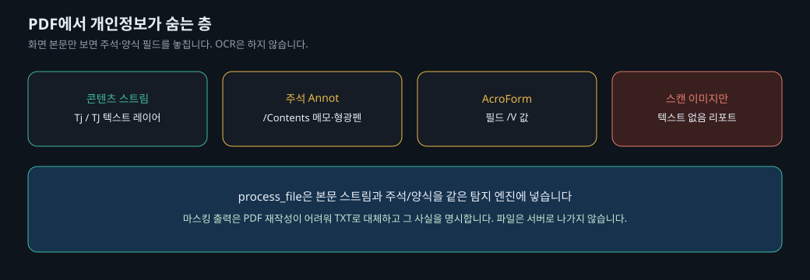

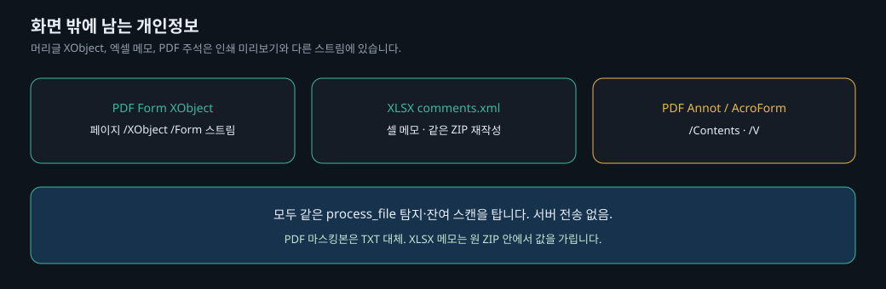

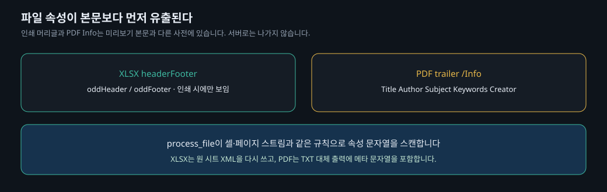

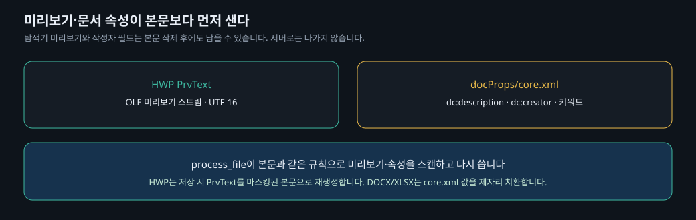

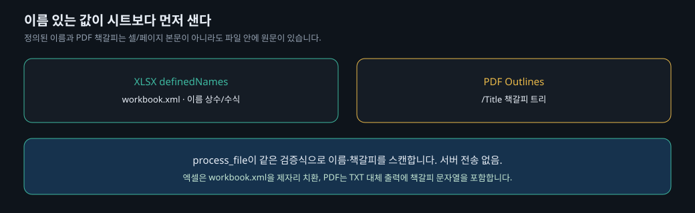

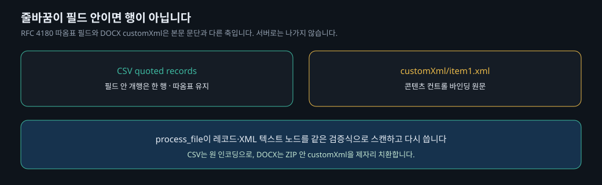

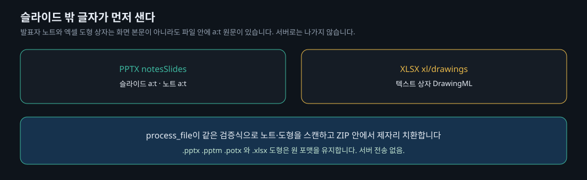

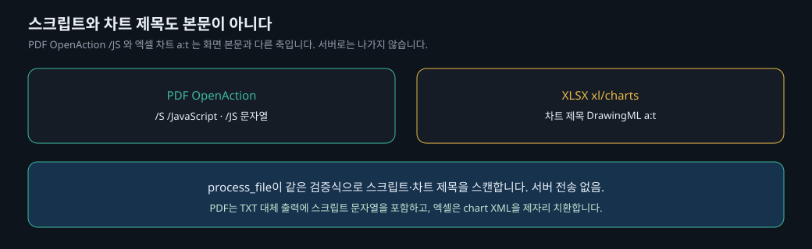

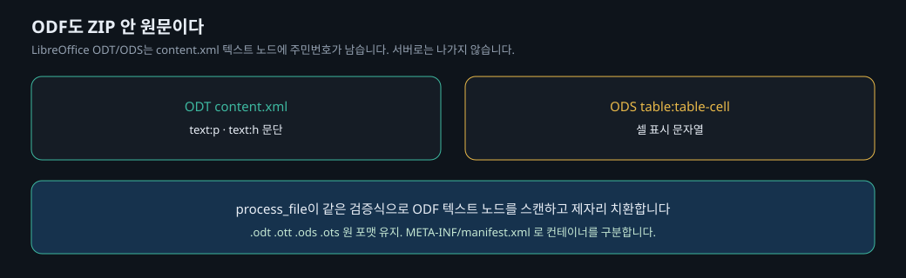

## 탐지와 마스킹

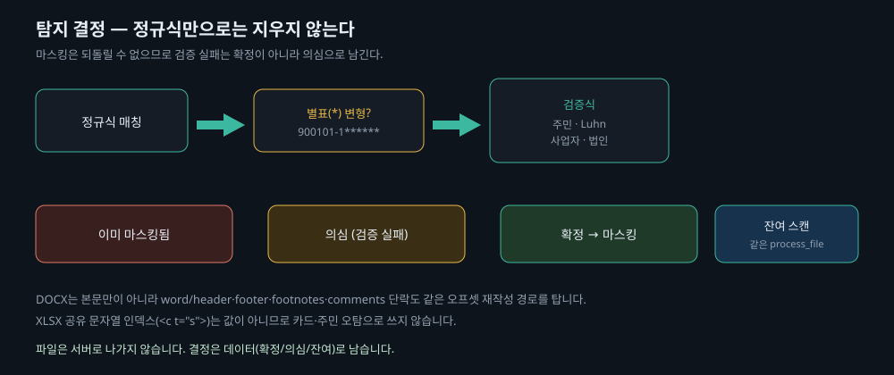


항목: 주민등록번호, 외국인등록번호, 운전면허, 여권, 휴대전화, 이메일, 주요 은행 계좌, 신용카드, 사업자등록번호, 법인등록번호, 건강보험증, IP.

정규식 매칭 뒤에 검증식을 반드시 태웁니다. 주민 체크섬, 카드 Luhn, 사업자·법인 체크섬이 실패하면 **의심**으로 따로 갑니다. `900101-1******`처럼 별표가 섞인 변형은 **이미 마스킹됨**입니다.

마스킹 모드: 전체(`*******`) · 부분(항목별 기본) · 치환(`[주민번호]`) · 삭제. 결과는 파일별·전체 CSV, JSON, HTML 리포트와 전/후 diff로 나갑니다. 규칙은 `pii-core/rules.toml`이며 UI에서 기관 커스텀 `[[rules]]`를 덮어쓸 수 있습니다.

DOCX는 본문만이 아니라 `word/header*.xml`, `footer`, `footnotes`, `endnotes`, `comments` 단락까지 같은 오프셋으로 지웁니다. XLSX에서 `t="s"` 셀의 `<v>`는 공유 문자열 **인덱스**이므로 카드·주민 숫자로 오인하지 않습니다. JSON 숫자는 마스킹 뒤에도 `serde_json`이 파싱 가능한 문서를 유지합니다. HWP **표 셀**도 본문과 같은 IR 경로로 마스킹합니다. TXT/CSV는 UTF-16 LE/BE BOM과 EUC-KR을 읽어 **같은 인코딩으로** 다시 씁니다. 따옴표로 감싼 CSV 필드도 헤더를 유지한 채 값만 가립니다.

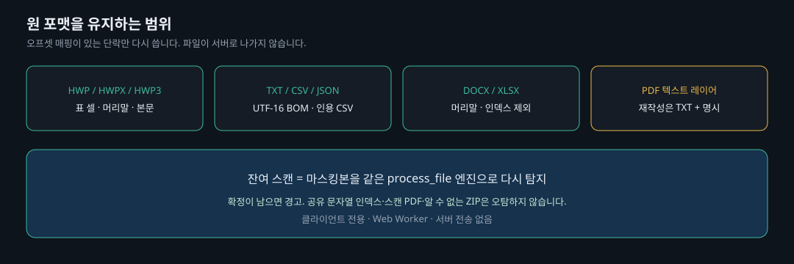

## 실행

```bash
# 코어 (WASM Worker가 부르는 것과 같은 process_file)
cargo test -p pii-core

cd web
npm install
npm run dev
```

브라우저에서 `http://127.0.0.1:4177` 을 엽니다. 폴더 또는 여러 파일을 드롭하면 이 기기에서만 처리합니다.

## 구조

- `pii-core` — 파싱 / 탐지 / 마스킹 / 잔여 스캔. 순수 바이트 입출력.
- `pii-wasm` — wasm-bindgen. Worker가 `process_bytes`만 호출.
- `web` — Vite + TypeScript, 프레임워크 없음. 메인 스레드는 UI.

저장소: https://github.com/kevin9327/pii-mask
